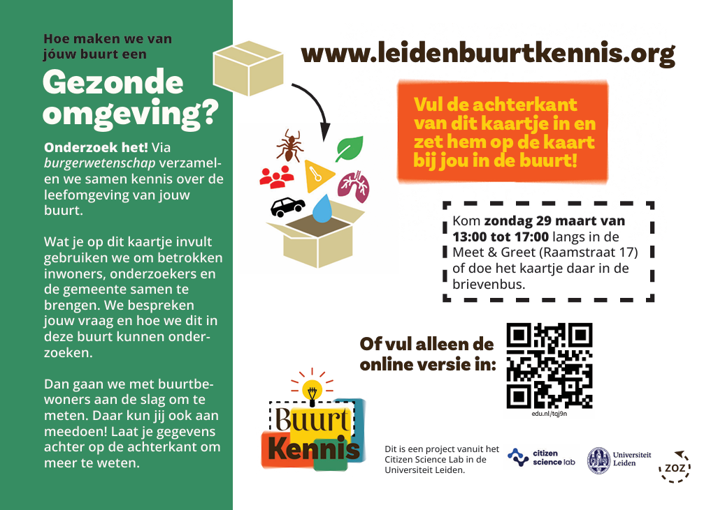

# (Online) kwestiekaartje

<figure><figcaption>
Uitnodiging voor bewoners om hun kwestie op de kaart te komen zetten, of alleen de online versie in te vullen
</figcaption></figure> <figure><figcaption>
Dit fysieke kaartje kon worden ingeleverd tijdens <a data-mention href="workshop-kwestiekaart.md">workshop-kwestiekaart.md</a>
</figcaption></figure>

Er is ook een online variant om mensen die niet kunnen tijdens het geprikte moment de mogelijkheid te geven een kwestie aan te kaarten. Daar kunnen zij alsnog aangeven in contact te willen blijven over dit onderwerp.&#x20;
